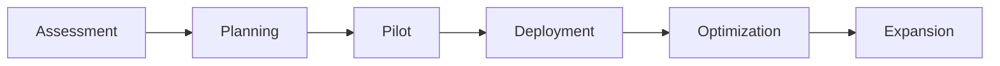

# Adoption Strategy and Onboarding Guide

**Version:** 2.0
**Status:** Production Ready
**Last Updated:** 2026-02-23

## Executive Summary

This document outlines the strategy for adopting Civic Attest in governmental and institutional environments, providing a structured approach to onboarding, integration, and organizational transformation.

## 1. Adoption Framework

### 1.1 Maturity Model

**Level 0: Awareness**
- Understanding of digital authenticity challenges
- Recognition of current vulnerabilities
- Exploration of solutions

**Level 1: Pilot**
- Small-scale deployment (1-3 use cases)
- Limited user base (<100 users)
- Evaluation and learning phase
- Duration: 3-6 months

**Level 2: Production**
- Organization-wide deployment
- Multiple use cases (3-10)
- Integrated into workflows
- Duration: 6-12 months

**Level 3: Enterprise**
- Mission-critical operations
- External-facing services
- Federation participation
- Duration: 12+ months

**Level 4: Ecosystem**
- Multi-organization deployment
- Public transparency operations
- Witness network participation
- Ongoing

### 1.2 Adoption Phases



## 2. Use Case Identification

### 2.1 High-Value Use Cases

**Tier 1: Immediate Impact**

1. **Executive Communications**
   - Official statements from elected officials
   - Policy announcements
   - Emergency declarations
   - **ROI:** Restore trust in official communications

2. **Legal Documents**
   - Ordinances and regulations
   - Contracts and agreements
   - Court documents
   - **ROI:** Reduce fraud, streamline verification

3. **Public Records**
   - Birth/death certificates
   - Property records
   - Business licenses
   - **ROI:** Reduce identity theft, simplify processes

**Tier 2: Strategic Enhancement**

4. **Press Releases**
   - Official media communications
   - Public information campaigns
   - **ROI:** Combat misinformation

5. **Internal Communications**
   - Policy memos
   - Directives
   - HR documents
   - **ROI:** Improve internal trust and compliance

6. **Procurement**
   - RFPs and bids
   - Contracts
   - Vendor communications
   - **ROI:** Reduce fraud, increase transparency

**Tier 3: Innovation**

7. **Open Data**
   - Public datasets
   - Research publications
   - Statistics and reports
   - **ROI:** Enhanced data integrity

8. **Citizen Services**
   - Permit applications
   - Tax documents
   - Voting information
   - **ROI:** Improved service delivery

### 2.2 Use Case Selection Criteria

**Evaluation Matrix:**

| Criterion | Weight | Scoring (1-5) |
|-----------|--------|---------------|
| Authentication need | 30% | High fraud risk = 5 |
| User impact | 25% | Many users affected = 5 |
| Implementation complexity | 20% | Simple integration = 5 |
| Regulatory requirement | 15% | Mandated = 5 |
| Visibility | 10% | High public awareness = 5 |

**Selection Process:**
1. Identify potential use cases (10-20)
2. Score each use case
3. Select top 3-5 for pilot
4. Validate with stakeholders
5. Prioritize based on dependencies

## 3. Stakeholder Engagement

### 3.1 Stakeholder Map

**Executive Leadership**
- **Role:** Strategic direction, budget approval
- **Engagement:** Quarterly briefings, ROI reports
- **Key Message:** "Restore public trust, reduce fraud"

**IT/Security Teams**
- **Role:** Technical implementation, operations
- **Engagement:** Weekly standups, technical reviews
- **Key Message:** "Enterprise-grade security, manageable operations"

**Legal/Compliance**
- **Role:** Risk assessment, policy development
- **Engagement:** Monthly reviews, policy workshops
- **Key Message:** "Regulatory compliance, legal defensibility"

**End Users (Staff)**
- **Role:** Daily usage, feedback
- **Engagement:** Training sessions, support channels
- **Key Message:** "Simple to use, improves workflow"

**External Partners**
- **Role:** Ecosystem participation, witness network
- **Engagement:** Federation meetings, governance participation
- **Key Message:** "Shared infrastructure, public benefit"

**Citizens/Public**
- **Role:** Verification, trust
- **Engagement:** Public dashboards, education campaigns
- **Key Message:** "Verify authenticity, trust but verify"

### 3.2 Communication Plan

**Internal Communications:**

```yaml
internal_comms:
  kickoff:
    audience: "all_staff"
    format: "town_hall"
    frequency: "once"
    message: "Why we're adopting Civic Attest"

  progress_updates:
    audience: "stakeholders"
    format: "newsletter"
    frequency: "monthly"
    message: "Implementation milestones, success stories"

  training:
    audience: "end_users"
    format: "workshops"
    frequency: "quarterly"
    message: "How to use, best practices"
```

**External Communications:**

```yaml
external_comms:
  announcement:
    audience: "public"
    format: "press_release"
    timing: "pilot_launch"
    message: "Enhancing trust in government communications"

  education:
    audience: "public"
    format: "website_faq"
    timing: "ongoing"
    message: "How to verify, what it means"

  transparency:
    audience: "public"
    format: "dashboard"
    timing: "production_launch"
    message: "Real-time verification statistics"
```

## 4. Implementation Roadmap

### 4.1 Phase 1: Assessment (4-6 weeks)

**Week 1-2: Discovery**
- [ ] Conduct stakeholder interviews
- [ ] Identify use cases
- [ ] Assess current systems
- [ ] Review security requirements
- [ ] Evaluate budget and resources

**Week 3-4: Analysis**
- [ ] Score and prioritize use cases
- [ ] Perform gap analysis
- [ ] Identify integration points
- [ ] Assess technical requirements
- [ ] Develop risk mitigation plan

**Week 5-6: Planning**
- [ ] Create project plan
- [ ] Define success criteria
- [ ] Establish governance structure
- [ ] Develop budget proposal
- [ ] Prepare executive presentation

**Deliverables:**
- Assessment report
- Use case priorities
- Project plan
- Budget proposal

### 4.2 Phase 2: Pilot (3-6 months)

**Month 1: Setup**
- [ ] Procure HSM (if needed)
- [ ] Provision infrastructure
- [ ] Install and configure Civic Attest
- [ ] Conduct key ceremony
- [ ] Establish trustee governance

**Month 2: Integration**
- [ ] Integrate with pilot use case system
- [ ] Develop workflows
- [ ] Create user documentation
- [ ] Train pilot users (20-50 people)
- [ ] Set up monitoring

**Month 3-4: Pilot Operation**
- [ ] Execute pilot use case
- [ ] Collect user feedback
- [ ] Monitor performance
- [ ] Address issues
- [ ] Measure success metrics

**Month 5-6: Evaluation**
- [ ] Analyze pilot results
- [ ] Document lessons learned
- [ ] Refine processes
- [ ] Update training materials
- [ ] Prepare expansion plan

**Success Criteria:**
- ✓ 95% signature success rate
- ✓ <100ms signature latency (p95)
- ✓ Zero security incidents
- ✓ >80% user satisfaction
- ✓ Measurable fraud reduction

### 4.3 Phase 3: Production Deployment (6-12 months)

**Quarter 1: Expansion**
- [ ] Deploy to additional use cases (3-5)
- [ ] Scale infrastructure
- [ ] Train additional users (100-500)
- [ ] Establish support processes
- [ ] Implement monitoring dashboards

**Quarter 2: Optimization**
- [ ] Tune performance
- [ ] Optimize workflows
- [ ] Enhance automation
- [ ] Expand integrations
- [ ] Develop advanced features

**Quarter 3: Maturity**
- [ ] Organization-wide deployment
- [ ] External-facing services
- [ ] Public verification dashboard
- [ ] Witness network participation
- [ ] Continuous improvement

**Quarter 4: Ecosystem**
- [ ] Multi-organization collaboration
- [ ] Federation participation
- [ ] Policy advocacy
- [ ] Community engagement
- [ ] Innovation initiatives

### 4.4 Ongoing: Operations & Maintenance

**Monthly:**
- [ ] Review performance metrics
- [ ] Update documentation
- [ ] Conduct user training
- [ ] Security patching
- [ ] Capacity planning

**Quarterly:**
- [ ] Security audit
- [ ] Disaster recovery drill
- [ ] Trustee governance meeting
- [ ] User satisfaction survey
- [ ] Technology refresh planning

**Annually:**
- [ ] Comprehensive security audit
- [ ] Key rotation ceremony
- [ ] Budget review
- [ ] Strategic planning
- [ ] Compliance certification

## 5. Training Program

### 5.1 Role-Based Training

**Trustee Training (8 hours)**
- Governance responsibilities
- Key ceremony procedures
- Emergency response
- Legal and compliance
- Ethics and conflicts of interest

**Operator Training (16 hours)**
- System architecture
- Operational procedures
- Monitoring and troubleshooting
- Security best practices
- Incident response

**End User Training (2 hours)**
- System overview
- Signing workflow
- Verification process
- Troubleshooting
- Best practices

**Developer Training (24 hours)**
- API documentation
- Integration patterns
- SDK usage
- Security considerations
- Testing and debugging

### 5.2 Training Materials

**Formats:**
- [ ] In-person workshops
- [ ] Online self-paced courses
- [ ] Video tutorials
- [ ] Written documentation
- [ ] Hands-on labs
- [ ] Certification exams

**Curriculum:**

```yaml
training_curriculum:
  fundamentals:
    duration: "4 hours"
    topics:
      - "Digital authenticity challenges"
      - "Cryptographic signatures"
      - "Public transparency"
      - "Civic Attest architecture"

  operations:
    duration: "8 hours"
    topics:
      - "Installation and configuration"
      - "Monitoring and alerting"
      - "Backup and recovery"
      - "Security hardening"
      - "Troubleshooting"

  integration:
    duration: "8 hours"
    topics:
      - "API reference"
      - "SDK usage"
      - "Workflow integration"
      - "Testing strategies"
      - "Deployment patterns"

  governance:
    duration: "4 hours"
    topics:
      - "Trustee responsibilities"
      - "Policy development"
      - "Incident response"
      - "Compliance requirements"
```

## 6. Change Management

### 6.1 Organizational Change

**Change Readiness Assessment:**

| Factor | Current State | Target State | Gap |
|--------|---------------|--------------|-----|
| Leadership support | Medium | High | Training needed |
| User capability | Low | High | Training required |
| Technical infrastructure | Medium | High | Upgrades needed |
| Process maturity | Low | High | Process development |
| Culture | Risk-averse | Security-conscious | Cultural shift |

**Change Strategy:**

1. **Create Urgency**
   - Communicate authentication challenges
   - Show fraud statistics
   - Demonstrate vulnerability

2. **Build Coalition**
   - Engage executive sponsors
   - Recruit champions
   - Form steering committee

3. **Develop Vision**
   - Articulate future state
   - Show benefits
   - Address concerns

4. **Communicate**
   - Regular updates
   - Multiple channels
   - Two-way dialogue

5. **Enable Action**
   - Provide training
   - Remove barriers
   - Quick wins

6. **Generate Wins**
   - Celebrate successes
   - Share stories
   - Build momentum

7. **Consolidate Gains**
   - Institutionalize changes
   - Update policies
   - Continuous improvement

8. **Anchor Change**
   - Embed in culture
   - Link to values
   - Maintain momentum

### 6.2 Resistance Management

**Common Objections:**

| Objection | Response |
|-----------|----------|
| "Too complex" | "Simple user interface, automated workflows" |
| "Too expensive" | "ROI from fraud reduction, efficiency gains" |
| "Not necessary" | "Regulatory trends, public trust imperative" |
| "Security concerns" | "Industry-standard crypto, security audits" |
| "Workflow disruption" | "Minimal changes, improved efficiency" |

**Mitigation Strategies:**
- Early stakeholder engagement
- Clear communication
- Hands-on training
- Quick wins demonstration
- Champion network
- Responsive support

## 7. Success Metrics

### 7.1 Key Performance Indicators

**Technical KPIs:**
- Signature throughput: >1,000/minute
- Verification latency: <100ms (p95)
- System uptime: >99.9%
- Security incidents: 0
- Data integrity: 100%

**Operational KPIs:**
- User adoption rate: >80%
- Training completion: >95%
- Support ticket resolution: <24 hours
- Incident response time: <1 hour
- Documentation currency: <30 days

**Business KPIs:**
- Fraud reduction: >50%
- Process efficiency: >30% improvement
- Public trust: >70% (survey)
- Cost savings: >$500K/year
- Regulatory compliance: 100%

### 7.2 Reporting Dashboard

**Monthly Report:**
```yaml
monthly_metrics:
  signatures_created: 10000
  verifications_performed: 50000
  unique_users: 500
  system_uptime: 99.95
  incidents: 0
  support_tickets: 25
  user_satisfaction: 4.5/5
```

**Quarterly Business Review:**
- Executive summary
- KPI trends
- Success stories
- Challenges and mitigation
- Roadmap update
- Budget vs. actuals

## 8. Risk Management

### 8.1 Risk Register

| Risk | Probability | Impact | Mitigation |
|------|------------|--------|------------|
| HSM failure | Low | High | Backup HSM, tested recovery |
| Key compromise | Very Low | Critical | Multi-party control, monitoring |
| User adoption resistance | Medium | Medium | Change management, training |
| Integration complexity | Medium | Medium | Pilot testing, phased rollout |
| Budget overrun | Low | Medium | Contingency planning, monitoring |
| Vendor dependency | Low | High | Open source, multiple vendors |
| Regulatory changes | Medium | Medium | Compliance monitoring, flexibility |

### 8.2 Contingency Plans

**Plan A: Pilot Failure**
- Conduct root cause analysis
- Develop remediation plan
- Re-pilot with improvements
- Update timeline

**Plan B: Budget Constraints**
- Prioritize essential features
- Phased deployment
- Seek additional funding
- Optimize costs

**Plan C: Technical Challenges**
- Engage vendor support
- Hire consultants
- Adjust scope
- Extended timeline

## 9. Cost-Benefit Analysis

### 9.1 Implementation Costs

| Category | Year 1 | Year 2 | Year 3 |
|----------|--------|--------|--------|
| HSM hardware | $50K | $10K | $10K |
| Infrastructure | $30K | $30K | $30K |
| Software licenses | $20K | $20K | $20K |
| Personnel | $200K | $150K | $150K |
| Training | $50K | $20K | $20K |
| Consulting | $100K | $30K | $30K |
| **Total** | **$450K** | **$260K** | **$260K** |

### 9.2 Benefits

**Quantifiable Benefits:**
- Fraud reduction: $500K/year
- Process automation: $300K/year
- Reduced verification costs: $100K/year
- Compliance efficiency: $50K/year
- **Total:** $950K/year

**Intangible Benefits:**
- Increased public trust
- Enhanced reputation
- Regulatory compliance
- Competitive advantage
- Innovation leadership

**ROI Calculation:**
- Year 1: ($450K + $950K) = +$500K
- Year 2: ($260K + $950K) = +$690K
- Year 3: ($260K + $950K) = +$690K
- **3-Year ROI:** 291%

## 10. Adoption Checklist

**Pre-Adoption:**
- [ ] Executive sponsorship secured
- [ ] Budget approved
- [ ] Use cases identified
- [ ] Stakeholders engaged
- [ ] Technical assessment complete
- [ ] Risk analysis done
- [ ] Success criteria defined

**Pilot Phase:**
- [ ] Infrastructure deployed
- [ ] Key ceremony complete
- [ ] Pilot users trained
- [ ] Integration tested
- [ ] Monitoring operational
- [ ] Support processes established
- [ ] Feedback mechanism active

**Production Phase:**
- [ ] Pilot successful
- [ ] Lessons learned documented
- [ ] Expansion plan approved
- [ ] Additional resources allocated
- [ ] Organization-wide training complete
- [ ] Public communications launched
- [ ] Continuous improvement process active

**Ecosystem Phase:**
- [ ] Federation participation
- [ ] Witness network operational
- [ ] Multi-organization collaboration
- [ ] Policy advocacy active
- [ ] Community engagement ongoing
- [ ] Innovation pipeline established

## Appendix A: Templates

See `templates/adoption/` for:
- Executive presentation template
- Project charter template
- Risk register template
- Training curriculum template
- Communication plan template
- Success metrics dashboard template

## Appendix B: Case Studies

See `case-studies/` for:
- Municipal government pilot
- State agency deployment
- Federal implementation
- Cross-border collaboration

---

**Document Owner:** Adoption Team
**Review Frequency:** Quarterly
**Next Review:** 2026-05-23
